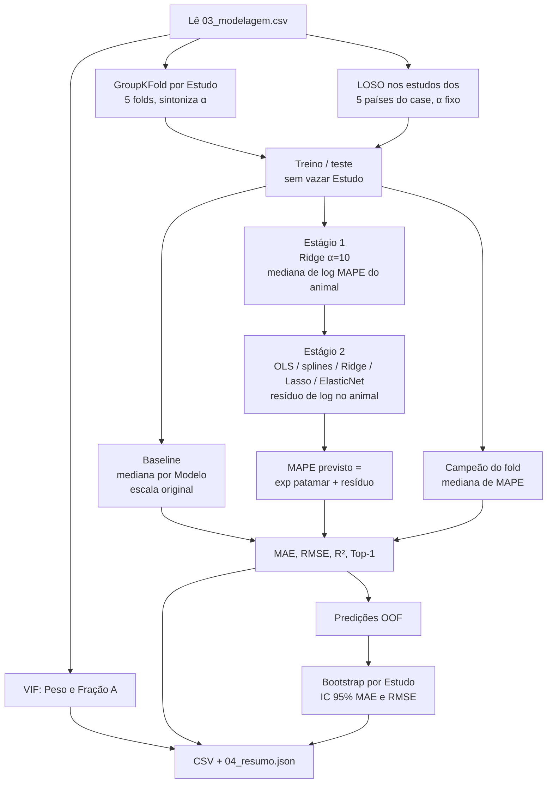

# Fluxograma — estratégia de modelagem (fase 04)

Documento do fluxo em `scripts/04_modelagem_validacao.py` (depois de `03_engenharia_features.R`).

Alvo final: **MAPE** na escala original. `Estudo` é só grupo de validação. País entra em one-hot **dentro do fold**.

## Visão da estratégia

O baseline chuta a mediana de MAPE por modelo empírico. Os demais modelos decompõem `log(MAPE)` em **patamar do animal** + **desvio do modelo**, porque cinco linhas repetem o mesmo indivíduo e o nível absoluto muda entre estudos.

## Dois estágios (regressores, não o baseline)

| Estágio | Unidade | Alvo | Features | Estimador |
| --- | --- | --- | --- | --- |
| 1. Patamar | uma linha por `ID_Observacao` | mediana de `MAPE_log` | numéricos + categorias **exceto** a coluna `Modelo` | Ridge, α = 10 |
| 2. Desvio | cinco linhas do animal | `MAPE_log` − mediana de log do animal | lista completa `X_COLS` | pipeline do fold |
| Reconstrução | linha | — | — | `exp(estágio1 + estágio2)` |

## Preditores no 04 (como no código)

| Bloco | Variáveis |
| --- | --- |
| Numéricos | `Peso_Corporal_kg`, `Fracao_Perda_A` (`Consumo_MS_kg` comentado) |
| Splines | só `Peso_Corporal_kg` (4 nós, grau 3); fração A linear |
| Categóricos | país, status, sexo, modelo, `Modelo_Status`, `Modelo_Sexo` (`cluster` comentado) |

## Modelos comparados

| Modelo | O que faz |
| --- | --- |
| Baseline | Mediana de MAPE por `Modelo` no treino (sem log, sem dois estágios) |
| OLS | Dois estágios; estágio 2 = `LinearRegression` após padronizar + one-hot |
| Splines | Dois estágios; estágio 2 = spline no peso + linear na fração A + one-hot |
| Ridge / Lasso / ElasticNet | Dois estágios; estágio 2 penalizado. No GroupKFold: grid de α (e `l1_ratio`) em CV interna de 2 splits. No LOSO: α padrão (10 / 0,01 / 0,01 e l1_ratio 0,5) |

## Diagnósticos e saídas

- **VIF:** cada numérico usado contra o outro; alerta se VIF ≥ 5 ou ≥ 10.
- **Bootstrap:** 2.000 reamostragens dos estudos nas predições OOF do GroupKFold.

Arquivos em `data/processed/`:

- `04_vif.csv`, `04_metricas_folds.csv`, `04_metricas_resumo.csv`
- `04_predicoes_oof.csv`, `04_bootstrap_ic.csv`, `04_resumo.json`

O Top-1 compara o `Modelo` de menor MAPE previsto com o real. A referência é “sempre o campeão do fold”. A regra formal está no script 05 (`05_decisao.json`).
