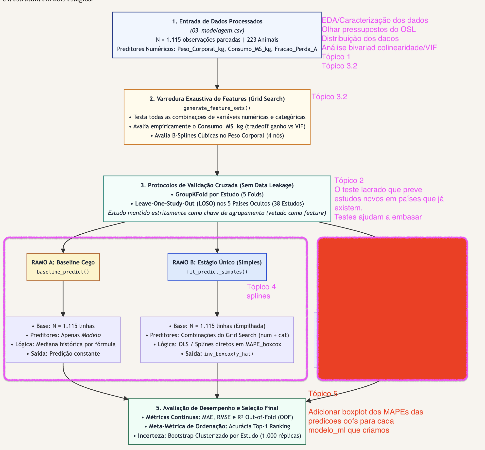

nível animal x modelo x modelo_ml, protocolo, fold: [04_predicoes_oof.csv](../data/processed/04_predicoes_oof.csv)
 modelo_ml, protocolo[04_metricas_folds.csv](../data/processed/04_metricas_folds.csv)
 modelo_ml, protocolo[04_metricas_resumo.csv](../data/processed/04_metricas_resumo.csv)

1. Boxplots - distribuição de MAPE por modelo_ml, protocolo e fold
2. Ajustar diagrama da metodologia/estratégia de modelagem (seção 4.5 cortar ramo 2 estágios)

